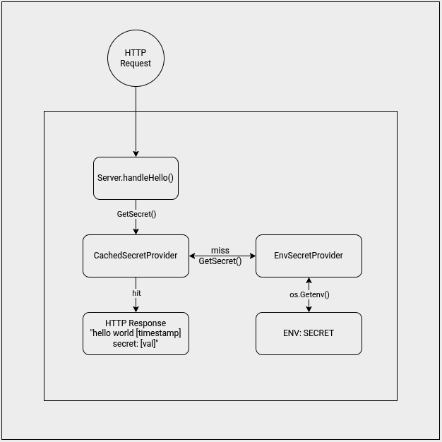

# Secure Go HTTP Server Template

A production-grade implementation of a high-performance HTTP service in Go. This project demonstrates advanced software engineering patterns including **Dependency Injection**, the **Decorator Pattern** for transparent caching, and secure secret management via **HashiCorp Vault**.

## Key Features

* **Secure Secret Injection**: Uses a Bash entrypoint to fetch secrets from HashiCorp Vault at container startup, injecting them into the process environment without leaving traces in the image layers.
* **Multi-Source Secret Management**: Supports retrieval from environment variables, filesystem mounts (e.g., `/tmpfs` or Kubernetes Secrets), and provides a transparent caching layer for all sources.
* **Dependency Injection (DI)**: The `Server` is decoupled from the OS via the `SecretProvider` interface, allowing for seamless switching between `EnvSecretProvider` (Production) and `MockSecretProvider` (Testing).

* **Decorator Pattern**: Implements a transparent caching layer (`CachedSecretProvider`) that wraps any `SecretProvider`. This allows adding TTL-based in-memory caching without modifying the underlying business logic.
* **Resilient Architecture**: Includes robust error handling to ensure that failures in the secret provider (e.g., Vault downtime) do not crash the service or leak sensitive error details to the client.
* **Production-Ready HTTP**: Configured with explicit timeouts (`ReadTimeout`, `WriteTimeout`, `IdleTimeout`) to prevent resource exhaustion and Slowloris attacks.

## Tech Stack

* **Language**: Go (1.22+)
* **Infrastructure**: Docker, Bash, HashiCorp Vault
* **Testing**: Go Testing Package (Built-in)
* **Pattern Architectures**: Interface-based DI, Decorator Pattern

## Project Structure

* `main.go`: Core logic, Server implementation
* `secrets.go`: The `SecretProvider` interface hierarchy.
* `main_test.go`: Comprehensive test suite covering mocks, error states, and cache expiration.
* `entrypoint.sh`: Bash script for Vault secret retrieval and environment injection at container startup.
* `Dockerfile`: Multi-stage build optimized for minimal attack surface and small image size.

## Testing

The test suite covers:

1. **Standard operation**: Verifying ISO8601 timestamp formats.
2. **Secret presence/absence**: Ensuring the "secret:" string only appears when a secret is provided.
3. **Error handling**: Simulating provider failures to ensure the server stays operational and does not leak error strings.
4. **Stress testing**: Validating memory stability with extremely large (1MB+) environment variables.
5. **Decorator Logic**: Verifying that the cache correctly reduces calls to the underlying provider and respects TTL expiration.
6. **Filesystem Secrets**: Validating that `FileSecretProvider` correctly parses key-value pairs from mounted files and integrates seamlessly with the caching layer.


Run tests using:
```bash
go test -v ./...
```

## Running with Docker

To run the container locally without a real Vault instance (simulating standard environment variables):
```bash
# Build the image
docker build -t go-secure-server .

# Run the container
docker run -p 8080:8080 -e SECRET="my-secret" go-secure-server
```

To use with **HashiCorp Vault** (Production Workflow):

```bash
docker run -p 8080:8080 \
  -e VAULT_ADDR='https://your-vault-url:8200' \
  -e VAULT_TOKEN='your-vault-token' \
  -e VAULT_SECRET_PATH='secret/data/path/go-secure-server' \
  go-secure-server
  ```

For additional security, `VAULT_TOKEN` should be a very short-lived token with a use-limit=1, so it is immediately rendered unusable once the container starts up.  Note that this will cause the container to permanently fail to start if it cannot start on the first launch. Setting a use-limit=10 and ttl=10 is also a viable approach, as this will allow the container to fail to start up to 10 times in 10 minutes, and this can be a viable compromise.


## Architecture Diagram (Logic Flow)



```text
[ HTTP Request ]
        ↓
[ Server.handleHello() ]
        ↓
[ CachedSecretProvider (Decorator) ] ──→ (Cache Hit? Return Value)
        ↓                               (Cache Miss/Expired?)
[ EnvSecretProvider (Base Impl) ] ───→ (Fetch from os.Getenv)
        ↓
[ Response: "hello world [timestamp] secret: [val]" ]
  ```

